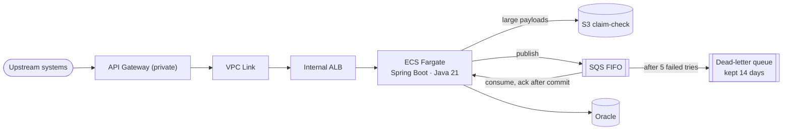

  
  
  
  

### The 30-second version

- **Backend engineer at Accenture** for 2 years 4 months on a Fortune 500 US insurance platform. Joined as an Associate in May 2024 and was **promoted to Analyst in June 2026**.
- I build **Java 21 / Spring Boot** services end to end. That covers the API design, the SQL tuning, the **AWS infrastructure in Terraform**, and the production defect when something breaks.
- **Looking for** backend engineering roles at product companies and GCCs, in Hyderabad or remote. I reply within a day.

### Shipped in production

| Project | What I did | Result |
| --- | --- | --- |
| **SOAP → Spring Boot** | Moved a 26-operation SOAP service off WebLogic and Ant onto Spring Boot 4 and Apache CXF on Java 21, including the javax → jakarta move, across three Oracle datasources. | Published WSDL **byte-for-byte identical** (SHA-256 checked). **Zero** client changes. |
| **IBM MQ → AWS** | Rebuilt an event and acknowledgement API, then provisioned API Gateway, VPC Link, an internal ALB, ECS Fargate, SQS FIFO with a DLQ, and an S3 claim-check in Terraform. | IBM MQ dispatch **retired**. Failed messages retry 5 times, then wait 14 days in the DLQ. |
| **Oracle Forms → 14 services** | Moved business rules out of Oracle Forms and PL/SQL into 5 experience-layer and 9 domain-layer Spring Boot services on Spring JDBC. | **20–40%** faster on frequently used APIs, with **80%+** test coverage. |
| **A 3-minute timeout** | Traced a production gateway timeout with HAR files and per-hop timing to an unbounded result set. Rebuilt the query path with paging and indexed lookups. | **3+ min → under 60 s.** |
| **GenAI defect triage** | Built an agent that drafts root-cause summaries from recurring defect patterns. A person reviews every draft before anyone acts on it. | Triage went from **about a day to minutes** across 25+ defects. |

> The client owns this code, so none of it is public. The [portfolio](https://pramodh-del.github.io/#/work) walks through each project with a diagram and explains the trade-offs.

### How one of them works

This is the event pipeline from the IBM MQ → AWS project. A message is deleted from SQS only after the database commit, so a crash causes a retry instead of a lost event.

### What I work with

  

| Area | Tools |
| --- | --- |
| **Backend** | Java 21 · Spring Boot 4 · Spring MVC · Spring JDBC · Spring Data JPA · Hibernate · REST · SOAP / Apache CXF |
| **Cloud** | AWS (SQS FIFO, ECS Fargate, S3, API Gateway, Lambda) · Terraform · Docker · AWS Certified Cloud Practitioner |
| **Data** | Oracle · SQL tuning · indexing · pagination · UCP connection pooling |
| **Quality** | JUnit 5 · Mockito · integration tests · global exception handling · Splunk |
| **Delivery** | Maven · Jenkins CI/CD · Git · SAFe Agile |

### Right now

- **Building** an HTTP server from raw sockets in plain Java 21. The goal is to see exactly what Tomcat and Spring Boot do for me: thread pools, virtual threads, and what happens when the queue fills up. It will be pinned here once it ships.
- **Learning** Kafka, and what Spring Cloud does under the hood.

### Hiring for a backend role?

The quickest way to reach me is the [contact form on my portfolio](https://pramodh-del.github.io/#/contact) or [email](mailto:pramodhkadam222@gmail.com). My [resume](https://pramodh-del.github.io/#/resume) opens in the browser, and there is a PDF if you need one.
